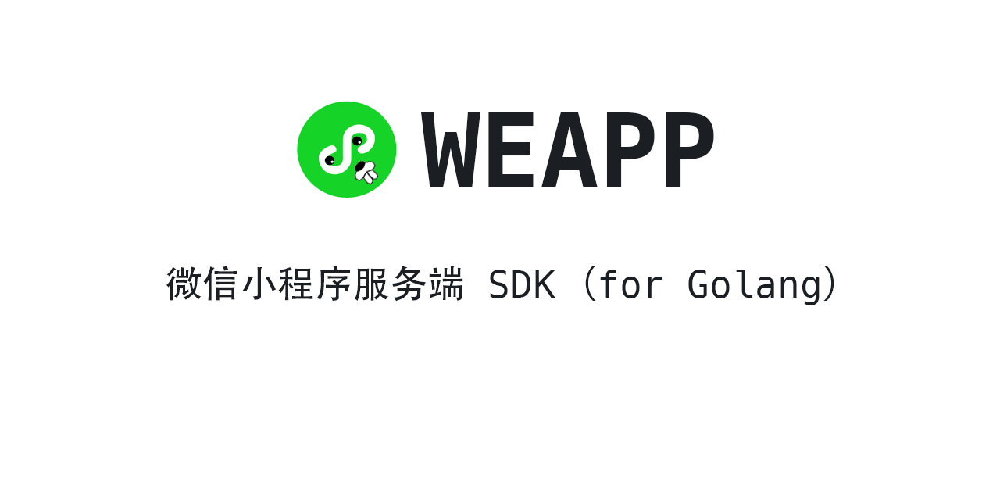

# 

## `注意` ⚠️

- [v1 版本入口](https://github.com/medivhzhan/weapp/tree/v1)
- 新版本暂时不包含支付相关内容, 已有很多优秀的支付相关模块;
- 为了保证大家及时用上新功能，已发布 v2 版本，请大家使用经过`线上测试` ✅ 的接口。
- 未完成的接口将在经过线上测试后在新版本中提供给大家。
- 大部分接口需要去线上测试。最近一直比较忙，有条件的朋友可以帮忙一起测试，我代表所有使用者谢谢你：）
- 欢迎大家一起完善 :)

## 获取代码

```sh

go get -u github.com/medivhzhan/weapp/v2

```

## `目录`

> 文档按照[小程序服务端官方文档](https://developers.weixin.qq.com/miniprogram/dev/api-backend/)排版，方便您一一对照查找相关内容。

✅：代表已经通过线上测试
⚠️：代表还没有或者未完成

- [登录](#登录)
  - [code2Session](#code2Session) ✅
- [用户信息](#用户信息)
  - [getPaidUnionId](#getPaidUnionId) ✅
- [接口调用凭证](#接口调用凭证)
  - [getAccessToken](#getAccessToken) ✅
- [数据分析](#数据分析)
  - [访问留存](#访问留存)
    - [getDailyRetain](#getDailyRetain) ✅
    - [getWeeklyRetain](#getWeeklyRetain) ✅
    - [getMonthlyRetain](#getMonthlyRetain) ✅
  - [getDailySummary](#getDailySummary) ✅
  - [访问趋势](#访问趋势)
    - [getDailyVisitTrend](#getDailyVisitTrend) ✅
    - [getWeeklyVisitTrend](#getWeeklyVisitTrend) ✅
    - [getMonthlyVisitTrend](#getMonthlyVisitTrend) ✅
  - [getUserPortrait](#getUserPortrait) ✅
  - [getVisitDistribution](#getVisitDistribution) ✅
  - [getVisitPage](#getVisitPage) ✅
- [客服消息](#客服消息)
  - [getTempMedia](#getTempMedia) ✅
  - [sendCustomerServiceMessage](#sendCustomerServiceMessage) ✅
  - [setTyping](#setTyping) ✅
  - [uploadTempMedia](#uploadTempMedia) ✅
- [统一服务消息](#统一服务消息)
  - [sendUniformMessage](#sendUniformMessage) ✅
- [动态消息](#动态消息)
  - [createActivityId](#createActivityId)
  - [setUpdatableMsg](#setUpdatableMsg)
- [插件管理](#插件管理)
  - [applyPlugin](#applyPlugin)
  - [getPluginDevApplyList](#getPluginDevApplyList)
  - [getPluginList](#getPluginList)
  - [setDevPluginApplyStatus](#setDevPluginApplyStatus)
  - [unbindPlugin](#unbindPlugin)
- [附近的小程序](#附近的小程序)
  - [addNearbyPoi](#addNearbyPoi)
  - [deleteNearbyPoi](#deleteNearbyPoi)
  - [getNearbyPoiList](#getNearbyPoiList)
  - [setNearbyPoiShowStatus](#setNearbyPoiShowStatus)
- [小程序码](#小程序码) ✅
  - [createQRCode](#createQRCode) ✅
  - [get](#get) ✅
  - [getUnlimited](#getUnlimited) ✅
- [内容安全](#内容安全)
  - [imgSecCheck](#imgSecCheck) ✅
  - [mediaCheckAsync](#mediaCheckAsync)✅
  - [msgSecCheck](#msgSecCheck) ✅
- [图像处理](#图像处理)
  - [aiCrop](#aiCrop) ✅
  - [scanQRCode](#scanQRCode) ✅
  - [superResolution](#superResolution)
- [及时配送](#及时配送) ⚠️
  - [小程序使用](#小程序使用)
    - [abnormalConfirm](#abnormalConfirm)
    - [addDeliveryOrder](#addDeliveryOrder)
    - [addDeliveryTip](#addDeliveryTip)
    - [cancelDeliveryOrder](#cancelDeliveryOrder)
    - [getAllImmediateDelivery](#getAllImmediateDelivery)
    - [getBindAccount](#getBindAccount)
    - [getDeliveryOrder](#getDeliveryOrder)
    - [mockUpdateDeliveryOrder](#mockUpdateDeliveryOrder)
    - [onDeliveryOrderStatus](#onDeliveryOrderStatus)
    - [preAddDeliveryOrder](#preAddDeliveryOrder)
    - [preCancelDeliveryOrder](#preCancelDeliveryOrder)
    - [reDeliveryOrder](#reDeliveryOrder)
  - [服务提供方使用](#服务提供方使用)
    - [updateDeliveryOrder](#updateDeliveryOrder)
    - [onAgentPosQuery](#onAgentPosQuery)
    - [onAuthInfoGet](#onAuthInfoGet)
    - [onCancelAuth](#onCancelAuth)
    - [onDeliveryOrderAdd](#onDeliveryOrderAdd)
    - [onDeliveryOrderAddTips](#onDeliveryOrderAddTips)
    - [onDeliveryOrderCancel](#onDeliveryOrderCancel)
    - [onDeliveryOrderConfirmReturn](#onDeliveryOrderConfirmReturn)
    - [onDeliveryOrderPreAdd](#onDeliveryOrderPreAdd)
    - [onDeliveryOrderPreCancel](#onDeliveryOrderPreCancel)
    - [onDeliveryOrderQuery](#onDeliveryOrderQuery)
    - [onDeliveryOrderReAdd](#onDeliveryOrderReAdd)
    - [onPreAuthCodeGet](#onPreAuthCodeGet)
    - [onRiderScoreSet](#onRiderScoreSet)
- [物流助手](#物流助手) ⚠️
  - [小程序使用](#小程序使用)
    - [addExpressOrder](#addExpressOrder)
    - [cancelExpressOrder](#cancelExpressOrder)
    - [getAllDelivery](#getAllDelivery)
    - [getExpressOrder](#getExpressOrder)
    - [getExpressPath](#getExpressPath)
    - [getExpressPrinter](#getExpressPrinter)
    - [getExpressQuota](#getExpressQuota)
    - [onExpressPathUpdate](#onExpressPathUpdate)
    - [testUpdateExpressOrder](#testUpdateExpressOrder)
    - [updateExpressPrinter](#updateExpressPrinter)
  - [服务提供方使用](#服务提供方使用)
    - [getExpressContact](#getExpressContact)
    - [onAddExpressOrder](#onAddExpressOrder)
    - [onCancelExpressOrder](#onCancelExpressOrder)
    - [onCheckExpressBusiness](#onCheckExpressBusiness)
    - [onGetExpressQuota](#onGetExpressQuota)
    - [previewExpressTemplate](#previewExpressTemplate)
    - [updateExpressBusiness](#updateExpressBusiness)
    - [updateExpressPath](#updateExpressPath)
- [OCR](#OCR)
  - [bankcard](#bankcard) ✅
  - [businessLicense](#businessLicense) ✅
  - [driverLicense](#driverLicense) ✅
  - [idcard](#idcard) ✅
  - [printedText](#printedText) ✅
  - [vehicleLicense](#vehicleLicense) ✅
- [运维中心](#运维中心) ⚠️
  - [realTimeLogSearch](#realTimeLogSearch)
- [小程序搜索](#小程序搜索) ⚠️
  - [siteSearch](#siteSearch)
  - [submitPages](#submitPages)
- [生物认证](#生物认证)
  - [verifySignature](#verifySignature)
- [订阅消息](#订阅消息) ✅
  - [addTemplate](#addTemplate) ✅
  - [deleteTemplate](#deleteTemplate) ✅
  - [getCategory](#getCategory) ✅
  - [getPubTemplateKeyWordsById](#getPubTemplateKeyWordsById)✅
  - [getPubTemplateTitleList](#getPubTemplateTitleList) ✅
  - [getTemplateList](#getTemplateList) ✅
  - [sendSubscribeMessage](#sendSubscribeMessage) ✅
- [解密](#解密)
  - [解密手机号码](#解密手机号码) ✅
  - [解密分享内容](#解密分享内容)
  - [解密用户信息](#解密用户信息) ✅
  - [解密微信运动](#解密微信运动)
- [人脸识别](#人脸识别)

---

## 登录

### code2Session

[官方文档](https://developers.weixin.qq.com/miniprogram/dev/api-backend/open-api/login/auth.code2Session.html)

```go

import "github.com/medivhzhan/weapp/v2"

res, err := weapp.Login("appid", "secret", "code")
if err != nil {
    // 处理一般错误信息
    return
}

if err := res.GetResponseError(); err !=nil {
    // 处理微信返回错误信息
    return
}

fmt.Printf("返回结果: %#v", res)

```

---

## 用户信息

### getPaidUnionId

[官方文档](https://developers.weixin.qq.com/miniprogram/dev/api-backend/open-api/user-info/auth.getPaidUnionId.html)

```go

import "github.com/medivhzhan/weapp/v2"

res, err := weapp.GetPaidUnionID("access-token", "open-id", "transaction-id")
// 或者
res, err := weapp.GetPaidUnionIDWithMCH("access-token", "open-id", "out-trade-number", "mch-id")

if err != nil {
    // 处理一般错误信息
    return
}

if err := res.GetResponseError(); err !=nil {
    // 处理微信返回错误信息
    return
}

fmt.Printf("返回结果: %#v", res)

```

---

## 接口调用凭证

### getAccessToken

> 调用次数有限制 请注意缓存

[官方文档](https://developers.weixin.qq.com/miniprogram/dev/api-backend/open-api/access-token/auth.getAccessToken.html)

```go

import "github.com/medivhzhan/weapp/v2"

res, err := weapp.GetAccessToken("appid", "secret")
if err != nil {
    // 处理一般错误信息
    return
}

if err := res.GetResponseError(); err !=nil {
    // 处理微信返回错误信息
    return
}

fmt.Printf("返回结果: %#v", res)

```

---

## 数据分析

### 访问留存

#### getDailyRetain

[官方文档](https://developers.weixin.qq.com/miniprogram/dev/api-backend/open-api/data-analysis/visit-retain/analysis.getDailyRetain.html)

```go

import "github.com/medivhzhan/weapp/v2"

res, err := weapp.GetDailyRetain("access-token", "begin-date", "end-date")
if err != nil {
    // 处理一般错误信息
    return
}

if err := res.GetResponseError(); err !=nil {
    // 处理微信返回错误信息
    return
}

fmt.Printf("返回结果: %#v", res)

```

#### getWeeklyRetain

[官方文档](https://developers.weixin.qq.com/miniprogram/dev/api-backend/open-api/data-analysis/visit-retain/analysis.getWeeklyRetain.html)

```go

import "github.com/medivhzhan/weapp/v2"

res, err := weapp.GetWeeklyRetain("access-token", "begin-date", "end-date")
if err != nil {
    // 处理一般错误信息
    return
}

if err := res.GetResponseError(); err !=nil {
    // 处理微信返回错误信息
    return
}

fmt.Printf("返回结果: %#v", res)

```

#### getMonthlyRetain

[官方文档](https://developers.weixin.qq.com/miniprogram/dev/api-backend/open-api/data-analysis/visit-retain/analysis.getMonthlyRetain.html)

```go

import "github.com/medivhzhan/weapp/v2"

res, err := weapp.GetMonthlyRetain("access-token", "begin-date", "end-date")
if err != nil {
    // 处理一般错误信息
    return
}

if err := res.GetResponseError(); err !=nil {
    // 处理微信返回错误信息
    return
}

fmt.Printf("返回结果: %#v", res)

```

### getDailySummary

[官方文档](https://developers.weixin.qq.com/miniprogram/dev/api-backend/open-api/data-analysis/analysis.getDailySummary.html)

```go

import "github.com/medivhzhan/weapp/v2"

res, err := weapp.GetDailySummary("access-token", "begin-date", "end-date")
if err != nil {
    // 处理一般错误信息
    return
}

if err := res.GetResponseError(); err !=nil {
    // 处理微信返回错误信息
    return
}

fmt.Printf("返回结果: %#v", res)

```

### 访问趋势

#### getDailyVisitTrend

[官方文档](https://developers.weixin.qq.com/miniprogram/dev/api-backend/open-api/data-analysis/visit-trend/analysis.getDailyVisitTrend.html)

```go

import "github.com/medivhzhan/weapp/v2"

res, err := weapp.GetDailyVisitTrend("access-token", "begin-date", "end-date")
if err != nil {
    // 处理一般错误信息
    return
}

if err := res.GetResponseError(); err !=nil {
    // 处理微信返回错误信息
    return
}

fmt.Printf("返回结果: %#v", res)

```

#### getWeeklyVisitTrend

[官方文档](https://developers.weixin.qq.com/miniprogram/dev/api-backend/open-api/data-analysis/visit-trend/analysis.getWeeklyVisitTrend.html)

```go

import "github.com/medivhzhan/weapp/v2"

res, err := weapp.GetWeeklyVisitTrend("access-token", "begin-date", "end-date")
if err != nil {
    // 处理一般错误信息
    return
}

if err := res.GetResponseError(); err !=nil {
    // 处理微信返回错误信息
    return
}

fmt.Printf("返回结果: %#v", res)

```

#### getMonthlyVisitTrend

[官方文档](https://developers.weixin.qq.com/miniprogram/dev/api-backend/open-api/data-analysis/visit-trend/analysis.getMonthlyVisitTrend.html)

```go

import "github.com/medivhzhan/weapp/v2"

res, err := weapp.GetMonthlyVisitTrend("access-token", "begin-date", "end-date")
if err != nil {
    // 处理一般错误信息
    return
}

if err := res.GetResponseError(); err !=nil {
    // 处理微信返回错误信息
    return
}

fmt.Printf("返回结果: %#v", res)

```

### getUserPortrait

[官方文档](https://developers.weixin.qq.com/miniprogram/dev/api-backend/open-api/data-analysis/analysis.getUserPortrait.html)

```go

import "github.com/medivhzhan/weapp/v2"

res, err := weapp.GetUserPortrait("access-token", "begin-date", "end-date")
if err != nil {
    // 处理一般错误信息
    return
}

if err := res.GetResponseError(); err !=nil {
    // 处理微信返回错误信息
    return
}

fmt.Printf("返回结果: %#v", res)

```

### getVisitDistribution

[官方文档](https://developers.weixin.qq.com/miniprogram/dev/api-backend/open-api/data-analysis/analysis.getVisitDistribution.html)

```go

import "github.com/medivhzhan/weapp/v2"

res, err := weapp.GetVisitDistribution("access-token", "begin-date", "end-date")
if err != nil {
    // 处理一般错误信息
    return
}

if err := res.GetResponseError(); err !=nil {
    // 处理微信返回错误信息
    return
}

fmt.Printf("返回结果: %#v", res)

```

### getVisitPage

[官方文档](https://developers.weixin.qq.com/miniprogram/dev/api-backend/open-api/data-analysis/analysis.getVisitPage.html)

```go

import "github.com/medivhzhan/weapp/v2"

res, err := weapp.GetVisitPage("access-token", "begin-date", "end-date")
if err != nil {
    // 处理一般错误信息
    return
}

if err := res.GetResponseError(); err !=nil {
    // 处理微信返回错误信息
    return
}

fmt.Printf("返回结果: %#v", res)

```

---

## 客服消息

### getTempMedia

[官方文档](https://developers.weixin.qq.com/miniprogram/dev/api-backend/open-api/customer-message/customerServiceMessage.getTempMedia.html)

```go

import "github.com/medivhzhan/weapp/v2"

resp, res, err := weapp.GetTempMedia("access-token", "media-id")
if err != nil {
    // 处理一般错误信息
    return
}
defer resp.Close()

if err := res.GetResponseError(); err !=nil {
    // 处理微信返回错误信息
    return
}

fmt.Printf("返回结果: %#v", res)

```

### sendCustomerServiceMessage

[官方文档](https://developers.weixin.qq.com/miniprogram/dev/api-backend/open-api/customer-message/customerServiceMessage.send.html)

```go

import "github.com/medivhzhan/weapp/v2"

// 接收并处理异步结果
srv, err := weapp.NewServer("app-id", "token", "aes-key", "mch-id", true)
if err != nil {
    // 处理微信返回错误信息
    return
}

// 文本消息
srv.OnCustomerServiceTextMessage(func(msg *v2.TextMessageResult) *v2.TransferCustomerMessage {

    msg := weapp.CSMsgText{
        Content: "content",
    }

    res, err := msg.SendTo("open-id", "access-token")
    if err != nil {
        // 处理一般错误信息
        return
    }

    if err := res.GetResponseError(); err !=nil {
        // 处理微信返回错误信息
        return
    }

    return nil
})

if err := srv.Serve(http.ResponseWriter, *http.Request); err != nil {
    // 处理微信返回错误信息
    return
}


// 图片消息
srv.OnCustomerServiceImageMessage(func(msg *v2.TextMessageResult) *v2.TransferCustomerMessage {

    msg := weapp.CSMsgImage{
        MediaID: "media-id",
    }

    res, err := msg.SendTo("open-id", "access-token")
    if err != nil {
        // 处理一般错误信息
        return
    }

    if err := res.GetResponseError(); err !=nil {
        // 处理微信返回错误信息
        return
    }

    return nil
})

if err := srv.Serve(http.ResponseWriter, *http.Request); err != nil {
    // 处理微信返回错误信息
    return
}


// 小程序卡片消息
srv.OnCustomerServiceCardMessage(func(msg *v2.TextMessageResult) *v2.TransferCustomerMessage {

    msg := weapp.CSMsgMPCard{
        Title:        "title",
        PagePath:     "page-path",
        ThumbMediaID: "thumb-media-id",
    }
    res, err := msg.SendTo("open-id", "access-token")
    if err != nil {
        // 处理一般错误信息
        return
    }

    if err := res.GetResponseError(); err !=nil {
        // 处理微信返回错误信息
        return
    }

    return nil
})

if err := srv.Serve(http.ResponseWriter, *http.Request); err != nil {
    // 处理微信返回错误信息
    return
}

```

### setTyping

[官方文档](https://developers.weixin.qq.com/miniprogram/dev/api-backend/open-api/customer-message/customerServiceMessage.setTyping.html)

```go

import "github.com/medivhzhan/weapp/v2"

res, err := weapp.SetTyping("access-token", "open-id", weapp.SetTypingCommandTyping)
if err != nil {
    // 处理一般错误信息
    return
}

if err := res.GetResponseError(); err !=nil {
    // 处理微信返回错误信息
    return
}

fmt.Printf("返回结果: %#v", res)

```

### uploadTempMedia

[官方文档](https://developers.weixin.qq.com/miniprogram/dev/api-backend/open-api/customer-message/customerServiceMessage.uploadTempMedia.html)

```go

import "github.com/medivhzhan/weapp/v2"

res, err := weapp.UploadTempMedia("access-token", weapp.TempMediaTypeImage, "media-filename")
if err != nil {
    // 处理一般错误信息
    return
}

if err := res.GetResponseError(); err !=nil {
    // 处理微信返回错误信息
    return
}

fmt.Printf("返回结果: %#v", res)

```

---

## 统一服务消息

### sendUniformMessage

[官方文档](https://developers.weixin.qq.com/miniprogram/dev/api-backend/open-api/uniform-message/uniformMessage.send.html)

```go

import "github.com/medivhzhan/weapp/v2"

sender := weapp.UniformMsgSender{
    ToUser: "open-id",
    UniformWeappTmpMsg: weapp.UniformWeappTmpMsg{
        TemplateID: "template-id",
        Page:       "page",
        FormID:     "form-id",
        Data: weapp.UniformMsgData{
            "keyword": {Value: "value"},
        },
        EmphasisKeyword: "keyword.DATA",
    },
    UniformMpTmpMsg: weapp.UniformMpTmpMsg{
        AppID:       "app-id",
        TemplateID:  "template-id",
        URL:         "url",
        Miniprogram: weapp.UniformMsgMiniprogram{"miniprogram-app-id", "page-path"},
        Data: weapp.UniformMsgData{
            "keyword": {"value", "color"},
        },
    },
}

res, err := sender.Send("access-token")
if err != nil {
    // 处理一般错误信息
    return
}

if err := res.GetResponseError(); err !=nil {
    // 处理微信返回错误信息
    return
}

fmt.Printf("返回结果: %#v", res)

```

---

## 动态消息

### createActivityId

[官方文档](https://developers.weixin.qq.com/miniprogram/dev/api-backend/open-api/updatable-message/updatableMessage.createActivityId.html)

```go

import "github.com/medivhzhan/weapp/v2"

res, err := weapp.CreateActivityId("access-token")
if err != nil {
    // 处理一般错误信息
    return
}

if err := res.GetResponseError(); err !=nil {
    // 处理微信返回错误信息
    return
}

fmt.Printf("返回结果: %#v", res)

```

### setUpdatableMsg

[官方文档](https://developers.weixin.qq.com/miniprogram/dev/api-backend/open-api/updatable-message/updatableMessage.setUpdatableMsg.html)

```go

import "github.com/medivhzhan/weapp/v2"


setter := weapp.UpdatableMsgSetter{
    "activity-id",
    UpdatableMsgJoining,
    UpdatableMsgTempInfo{
        []UpdatableMsgParameter{
            {UpdatableMsgParamMemberCount, "parameter-value-number"},
            {UpdatableMsgParamRoomLimit, "parameter-value-number"},
        },
    },
}

res, err := setter.Set("access-token")
if err != nil {
    // 处理一般错误信息
    return
}

if err := res.GetResponseError(); err !=nil {
    // 处理微信返回错误信息
    return
}

fmt.Printf("返回结果: %#v", res)

```

---

## 插件管理

### applyPlugin

[官方文档](https://developers.weixin.qq.com/miniprogram/dev/api-backend/open-api/plugin-management/pluginManager.applyPlugin.html)

```go

import "github.com/medivhzhan/weapp/v2"

res, err := weapp.ApplyPlugin("access-token", "plugin-app-id", "reason")
if err != nil {
    // 处理一般错误信息
    return
}

if err := res.GetResponseError(); err !=nil {
    // 处理微信返回错误信息
    return
}

fmt.Printf("返回结果: %#v", res)

```

### getPluginDevApplyList

[官方文档](https://developers.weixin.qq.com/miniprogram/dev/api-backend/open-api/plugin-management/pluginManager.getPluginDevApplyList.html)

```go

import "github.com/medivhzhan/weapp/v2"

res, err := weapp.GetPluginDevApplyList("access-token", 1, 2)
if err != nil {
    // 处理一般错误信息
    return
}

if err := res.GetResponseError(); err !=nil {
    // 处理微信返回错误信息
    return
}

fmt.Printf("返回结果: %#v", res)

```

### getPluginList

[官方文档](https://developers.weixin.qq.com/miniprogram/dev/api-backend/open-api/plugin-management/pluginManager.getPluginList.html)

```go

import "github.com/medivhzhan/weapp/v2"

res, err := weapp.GetPluginList("access-token")
if err != nil {
    // 处理一般错误信息
    return
}

if err := res.GetResponseError(); err !=nil {
    // 处理微信返回错误信息
    return
}

fmt.Printf("返回结果: %#v", res)

```

### setDevPluginApplyStatus

[官方文档](https://developers.weixin.qq.com/miniprogram/dev/api-backend/open-api/plugin-management/pluginManager.setDevPluginApplyStatus.html)

```go

import "github.com/medivhzhan/weapp/v2"

res, err := weapp.SetDevPluginApplyStatus("access-token", "plugin-app-id", "reason", weapp.DevAgree)
if err != nil {
    // 处理一般错误信息
    return
}

if err := res.GetResponseError(); err !=nil {
    // 处理微信返回错误信息
    return
}

fmt.Printf("返回结果: %#v", res)

```

### unbindPlugin

[官方文档](https://developers.weixin.qq.com/miniprogram/dev/api-backend/open-api/plugin-management/pluginManager.unbindPlugin.html)

```go

import "github.com/medivhzhan/weapp/v2"

res, err := weapp.UnbindPlugin("access-token", "plugin-app-id")
if err != nil {
    // 处理一般错误信息
    return
}

if err := res.GetResponseError(); err !=nil {
    // 处理微信返回错误信息
    return
}

fmt.Printf("返回结果: %#v", res)

```

---

## 附近的小程序

### addNearbyPoi

[官方文档](https://developers.weixin.qq.com/miniprogram/dev/api-backend/open-api/nearby-poi/nearbyPoi.add.html)

```go

import "github.com/medivhzhan/weapp/v2"

poi := NearbyPoi{
    PicList: PicList{[]string{"first-picture-url", "second-picture-url", "third-picture-url"}},
    ServiceInfos: weapp.ServiceInfos{[]weapp.ServiceInfo{
        {1, 1, "name", "app-id", "path"},
    }},
    StoreName:         "store-name",
    Hour:              "11:11-12:12",
    Credential:        "credential",
    Address:           "address",                         // 地址 必填
    CompanyName:       "company-name",                    // 主体名字 必填
    QualificationList: "qualification-list",              // 证明材料 必填 如果company_name和该小程序主体不一致，需要填qualification_list，详细规则见附近的小程序使用指南-如何证明门店的经营主体跟公众号或小程序帐号主体相关http://kf.qq.com/faq/170401MbUnim17040122m2qY.html
    KFInfo:            weapp.KFInfo{true, "kf-head-img", "kf-name"}, // 客服信息 选填，可自定义服务头像与昵称，具体填写字段见下方示例kf_info pic_list是字符串，内容是一个json！
    PoiID:             "poi-id",                          // 如果创建新的门店，poi_id字段为空 如果更新门店，poi_id参数则填对应门店的poi_id 选填
}

res, err := poi.Add("access-token")
if err != nil {
    // 处理一般错误信息
    return
}

if err := res.GetResponseError(); err !=nil {
    // 处理微信返回错误信息
    return
}

fmt.Printf("返回结果: %#v", res)

// 接收并处理异步结果
srv, err := weapp.NewServer("app-id", "token", "aes-key", "mch-id", true)
if err != nil {
    // 处理微信返回错误信息
    return
}

srv.OnAddNearbyPoi(func(mix *weapp.AddNearbyPoiResult) {
    // 处理返回结果
})

if err := srv.Serve(http.ResponseWriter, *http.Request); err != nil {
    // 处理微信返回错误信息
    return
}

```

### deleteNearbyPoi

[官方文档](https://developers.weixin.qq.com/miniprogram/dev/api-backend/open-api/nearby-poi/nearbyPoi.delete.html)

```go

import "github.com/medivhzhan/weapp/v2"

res, err := weapp.DeleteNearbyPoi("access-token", "poi-id")
if err != nil {
    // 处理一般错误信息
    return
}

if err := res.GetResponseError(); err !=nil {
    // 处理微信返回错误信息
    return
}

fmt.Printf("返回结果: %#v", res)

```

### getNearbyPoiList

[官方文档](https://developers.weixin.qq.com/miniprogram/dev/api-backend/open-api/nearby-poi/nearbyPoi.getList.html)

```go

import "github.com/medivhzhan/weapp/v2"

res, err := weapp.GetNearbyPoiList("access-token", 1, 10)
if err != nil {
    // 处理一般错误信息
    return
}

if err := res.GetResponseError(); err !=nil {
    // 处理微信返回错误信息
    return
}

fmt.Printf("返回结果: %#v", res)

```

### setNearbyPoiShowStatus

[官方文档](https://developers.weixin.qq.com/miniprogram/dev/api-backend/open-api/nearby-poi/nearbyPoi.setShowStatus.html)

```go

import "github.com/medivhzhan/weapp/v2"

res, err := weapp.SetNearbyPoiShowStatus("access-token", "poi-id", weapp.ShowNearbyPoi)
// 或者
res, err := weapp.SetNearbyPoiShowStatus("access-token", "poi-id", weapp.HideNearbyPoi)
if err != nil {
    // 处理一般错误信息
    return
}

if err := res.GetResponseError(); err !=nil {
    // 处理微信返回错误信息
    return
}

fmt.Printf("返回结果: %#v", res)

```

---

## 小程序码

### createQRCode

[官方文档](https://developers.weixin.qq.com/miniprogram/dev/api-backend/open-api/qr-code/wxacode.createQRCode.html)

```go

import (
    "ioutil"
    "github.com/medivhzhan/weapp/v2"
)


creator := weapp.QRCodeCreator{
    Path:  "mock/path",
    Width: 430,
}

resp, res, err := creator.Create("access-token")
if err != nil {
    // 处理一般错误信息
    return
}

if err := res.GetResponseError(); err !=nil {
    // 处理微信返回错误信息
    return
}
defer resp.Body.Close()

content, err := ioutil.ReadAll(resp.Body)
// 处理图片内容

```

### get

[官方文档](https://developers.weixin.qq.com/miniprogram/dev/api-backend/open-api/qr-code/wxacode.get.html)

```go

import (
    "ioutil"
    "github.com/medivhzhan/weapp/v2"
)


getter := weapp.QRCode{
    Path:      "mock/path",
    Width:     430,
    AutoColor: true,
    LineColor: weapp.Color{"r", "g", "b"},
    IsHyaline: true,
}

resp, res, err := getter.Get("access-token")
if err != nil {
    // 处理一般错误信息
    return
}

if err := res.GetResponseError(); err !=nil {
    // 处理微信返回错误信息
    return
}
defer resp.Body.Close()

content, err := ioutil.ReadAll(resp.Body)
// 处理图片内容

```

### getUnlimited

[官方文档](https://developers.weixin.qq.com/miniprogram/dev/api-backend/open-api/qr-code/wxacode.getUnlimited.html)

```go

import (
    "ioutil"
    "github.com/medivhzhan/weapp/v2"
)


getter :=  weapp.UnlimitedQRCode{
    Scene:     "scene-data",
    Page:      "mock/page",
    Width:     430,
    AutoColor: true,
    LineColor: weapp.Color{"r", "g", "b"},
    IsHyaline: true,
}

resp, res, err := getter.Get("access-token")
if err != nil {
    // 处理一般错误信息
    return
}

if err := res.GetResponseError(); err !=nil {
    // 处理微信返回错误信息
    return
}
defer resp.Body.Close()

content, err := ioutil.ReadAll(resp.Body)
// 处理图片内容

```

---

## 内容安全

### imgSecCheck

[官方文档](https://developers.weixin.qq.com/miniprogram/dev/api-backend/open-api/sec-check/security.imgSecCheck.html)

```go

import "github.com/medivhzhan/weapp/v2"

res, err := weapp.IMGSecCheck("access-token", "local-filename")
if err != nil {
    // 处理一般错误信息
    return
}

if err := res.GetResponseError(); err !=nil {
    // 处理微信返回错误信息
    return
}

fmt.Printf("返回结果: %#v", res)

```

### mediaCheckAsync

[官方文档](https://developers.weixin.qq.com/miniprogram/dev/api-backend/open-api/sec-check/security.mediaCheckAsync.html)

```go

import "github.com/medivhzhan/weapp/v2"

res, err := weapp.MediaCheckAsync("access-token", "image-url", weapp.MediaTypeImage)
if err != nil {
    // 处理一般错误信息
    return
}

if err := res.GetResponseError(); err !=nil {
    // 处理微信返回错误信息
    return
}

fmt.Printf("返回结果: %#v", res)

// 接收并处理异步结果
srv, err := weapp.NewServer("app-id", "token", "aes-key", "mch-id", true)
if err != nil {
    // 处理微信返回错误信息
    return
}

srv.OnMediaCheckAsync(func(mix *weapp.MediaCheckAsyncResult) {
    // 处理返回结果
})

if err := srv.Serve(http.ResponseWriter, *http.Request); err != nil {
    // 处理微信返回错误信息
    return
}

```

### msgSecCheck

[官方文档](https://developers.weixin.qq.com/miniprogram/dev/api-backend/open-api/sec-check/security.msgSecCheck.html)

```go

import "github.com/medivhzhan/weapp/v2"

res, err := weapp.MSGSecCheck("access-token", "message-content")
if err != nil {
    // 处理一般错误信息
    return
}

if err := res.GetResponseError(); err !=nil {
    // 处理微信返回错误信息
    return
}

fmt.Printf("返回结果: %#v", res)

```

---

## 图像处理

### aiCrop

[官方文档](https://developers.weixin.qq.com/miniprogram/dev/api-backend/open-api/img/img.aiCrop.html)

```go

import "github.com/medivhzhan/weapp/v2"

res, err := weapp.AICrop("access-token", "filename")
// 或者
res, err := weapp.AICropByURL("access-token", "url")
if err != nil {
    // 处理一般错误信息
    return
}

if err := res.GetResponseError(); err !=nil {
    // 处理微信返回错误信息
    return
}

fmt.Printf("返回结果: %#v", res)

```

### scanQRCode

[官方文档](https://developers.weixin.qq.com/miniprogram/dev/api-backend/open-api/img/img.scanQRCode.html)

```go

import "github.com/medivhzhan/weapp/v2"

res, err := weapp.ScanQRCode("access-token", "file-path")
// 或者
res, err := weapp.ScanQRCodeByURL("access-token", "qr-code-url")
if err != nil {
    // 处理一般错误信息
    return
}

if err := res.GetResponseError(); err !=nil {
    // 处理微信返回错误信息
    return
}

fmt.Printf("返回结果: %#v", res)

```

### superResolution

[官方文档](https://developers.weixin.qq.com/miniprogram/dev/api-backend/open-api/img/img.superresolution.html)

```go

import "github.com/medivhzhan/weapp/v2"

res, err := weapp.SuperResolution("access-token", "file-path")
// 或者
res, err := weapp.SuperResolutionByURL("access-token", "img-url")
if err != nil {
    // 处理一般错误信息
    return
}

if err := res.GetResponseError(); err !=nil {
    // 处理微信返回错误信息
    return
}

fmt.Printf("返回结果: %#v", res)

```

---

## 及时配送

### 服务提供方使用

#### updateDeliveryOrder

[官方文档](https://developers.weixin.qq.com/miniprogram/dev/api-backend/open-api/immediate-delivery/by-provider/immediateDelivery.updateOrder.html)

```go

import "github.com/medivhzhan/weapp/v2"

mocker := weapp.DeliveryOrderUpdater{
   // ...
}

res, err := mocker.Update("access-token")
if err != nil {
    // 处理一般错误信息
    return
}

if err := res.GetResponseError(); err !=nil {
    // 处理微信返回错误信息
    return
}

fmt.Printf("返回结果: %#v", res)

```

#### onAgentPosQuery

[官方文档](https://developers.weixin.qq.com/miniprogram/dev/api-backend/open-api/immediate-delivery/by-provider/immediateDelivery.onAgentPosQuery.html)

```go

import "github.com/medivhzhan/weapp/v2"

srv, err := weapp.NewServer("app-id", "token", "aes-key", "mch-id", true)
if err != nil {
    // 处理微信返回错误信息
    return
}

srv.OnAgentPosQuery(func(mix *weapp.AgentPosQueryResult) *weapp.AgentPosQueryReturn {
    // 处理返回结果

    return &weapp.AgentPosQueryReturn{
        // ...
    }
})

if err := srv.Serve(http.ResponseWriter, *http.Request); err != nil {
    // 处理微信返回错误信息
    return
}

```

#### onAuthInfoGet

[官方文档](https://developers.weixin.qq.com/miniprogram/dev/api-backend/open-api/immediate-delivery/by-provider/immediateDelivery.onAuthInfoGet.html)

```go

import "github.com/medivhzhan/weapp/v2"

srv, err := weapp.NewServer("app-id", "token", "aes-key", "mch-id", true)
if err != nil {
    // 处理微信返回错误信息
    return
}

srv.OnAuthInfoGet(func(mix *weapp.AuthInfoGetResult) *weapp.AuthInfoGetReturn {
    // 处理返回结果

    return &weapp.AuthInfoGetReturn{
        // ...
    }
})

if err := srv.Serve(http.ResponseWriter, *http.Request); err != nil {
    // 处理微信返回错误信息
    return
}

```

#### onCancelAuth

[官方文档](https://developers.weixin.qq.com/miniprogram/dev/api-backend/open-api/immediate-delivery/by-provider/immediateDelivery.onCancelAuth.html)

```go

import "github.com/medivhzhan/weapp/v2"

srv, err := weapp.NewServer("app-id", "token", "aes-key", "mch-id", true)
if err != nil {
    // 处理微信返回错误信息
    return
}

srv.OnCancelAuth(func(mix *weapp.CancelAuthResult) *weapp.CancelAuthReturn {
    // 处理返回结果

    return &weapp.CancelAuthReturn{
        // ...
    }
})

if err := srv.Serve(http.ResponseWriter, *http.Request); err != nil {
    // 处理微信返回错误信息
    return
}

```

#### onDeliveryOrderAdd

[官方文档](https://developers.weixin.qq.com/miniprogram/dev/api-backend/open-api/immediate-delivery/by-provider/immediateDelivery.onOrderAdd.html)

```go

import "github.com/medivhzhan/weapp/v2"

srv, err := weapp.NewServer("app-id", "token", "aes-key", "mch-id", true)
if err != nil {
    // 处理微信返回错误信息
    return
}

srv.OnDeliveryOrderAdd(func(mix *weapp.DeliveryOrderAddResult) *weapp.DeliveryOrderAddReturn {
    // 处理返回结果

    return &weapp.DeliveryOrderAddReturn{
        // ...
    }
})

if err := srv.Serve(http.ResponseWriter, *http.Request); err != nil {
    // 处理微信返回错误信息
    return
}

```

#### onDeliveryOrderAddTips

[官方文档](https://developers.weixin.qq.com/miniprogram/dev/api-backend/open-api/immediate-delivery/by-provider/immediateDelivery.onOrderAddTips.html)

```go

import "github.com/medivhzhan/weapp/v2"

srv, err := weapp.NewServer("app-id", "token", "aes-key", "mch-id", true)
if err != nil {
    // 处理微信返回错误信息
    return
}

srv.OnDeliveryOrderAddTips(func(mix *weapp.DeliveryOrderAddTipsResult) *weapp.DeliveryOrderAddTipsReturn {
    // 处理返回结果

    return &weapp.DeliveryOrderAddTipsReturn{
        // ...
    }
})

if err := srv.Serve(http.ResponseWriter, *http.Request); err != nil {
    // 处理微信返回错误信息
    return
}

```

#### onDeliveryOrderCancel

[官方文档](https://developers.weixin.qq.com/miniprogram/dev/api-backend/open-api/immediate-delivery/by-provider/immediateDelivery.onOrderCancel.html)

```go

import "github.com/medivhzhan/weapp/v2"

srv, err := weapp.NewServer("app-id", "token", "aes-key", "mch-id", true)
if err != nil {
    // 处理微信返回错误信息
    return
}

srv.OnDeliveryOrderCancel(func(mix *weapp.DeliveryOrderCancelResult) *weapp.DeliveryOrderCancelReturn {
    // 处理返回结果

    return &weapp.DeliveryOrderCancelReturn{
        // ...
    }
})

if err := srv.Serve(http.ResponseWriter, *http.Request); err != nil {
    // 处理微信返回错误信息
    return
}

```

#### onDeliveryOrderConfirmReturn

[官方文档](https://developers.weixin.qq.com/miniprogram/dev/api-backend/open-api/immediate-delivery/by-provider/immediateDelivery.onOrderConfirmReturn.html)

```go

import "github.com/medivhzhan/weapp/v2"

srv, err := weapp.NewServer("app-id", "token", "aes-key", "mch-id", true)
if err != nil {
    // 处理微信返回错误信息
    return
}

srv.OnDeliveryOrderReturnConfirm(func(mix *weapp.DeliveryOrderReturnConfirmResult) *weapp.DeliveryOrderReturnConfirmReturn {
    // 处理返回结果

    return &weapp.DeliveryOrderReturnConfirmReturn{
        // ...
    }
})

if err := srv.Serve(http.ResponseWriter, *http.Request); err != nil {
    // 处理微信返回错误信息
    return
}

```

#### onDeliveryOrderPreAdd

[官方文档](https://developers.weixin.qq.com/miniprogram/dev/api-backend/open-api/immediate-delivery/by-provider/immediateDelivery.onOrderPreAdd.html)

```go

import "github.com/medivhzhan/weapp/v2"

srv, err := weapp.NewServer("app-id", "token", "aes-key", "mch-id", true)
if err != nil {
    // 处理微信返回错误信息
    return
}

srv.OnDeliveryOrderPreAdd(func(mix *weapp.DeliveryOrderPreAddResult) *weapp.DeliveryOrderPreAddReturn {
    // 处理返回结果

    return &weapp.DeliveryOrderPreAddReturn{
        // ...
    }
})

if err := srv.Serve(http.ResponseWriter, *http.Request); err != nil {
    // 处理微信返回错误信息
    return
}

```

#### onDeliveryOrderPreCancel

[官方文档](https://developers.weixin.qq.com/miniprogram/dev/api-backend/open-api/immediate-delivery/by-provider/immediateDelivery.onOrderPreCancel.html)

```go

import "github.com/medivhzhan/weapp/v2"

srv, err := weapp.NewServer("app-id", "token", "aes-key", "mch-id", true)
if err != nil {
    // 处理微信返回错误信息
    return
}

srv.OnDeliveryOrderPreCancel(func(mix *weapp.DeliveryOrderPreCancelResult) *weapp.DeliveryOrderPreCancelReturn {
    // 处理返回结果

    return &weapp.DeliveryOrderPreCancelReturn{
        // ...
    }
})

if err := srv.Serve(http.ResponseWriter, *http.Request); err != nil {
    // 处理微信返回错误信息
    return
}

```

#### onDeliveryOrderQuery

[官方文档](https://developers.weixin.qq.com/miniprogram/dev/api-backend/open-api/immediate-delivery/by-provider/immediateDelivery.onOrderQuery.html)

```go

import "github.com/medivhzhan/weapp/v2"

srv, err := weapp.NewServer("app-id", "token", "aes-key", "mch-id", true)
if err != nil {
    // 处理微信返回错误信息
    return
}

srv.OnDeliveryOrderQuery(func(mix *weapp.DeliveryOrderQueryResult) *weapp.DeliveryOrderQueryReturn {
    // 处理返回结果

    return &weapp.DeliveryOrderQueryReturn{
        // ...
    }
})

if err := srv.Serve(http.ResponseWriter, *http.Request); err != nil {
    // 处理微信返回错误信息
    return
}

```

#### onDeliveryOrderReAdd

[官方文档](https://developers.weixin.qq.com/miniprogram/dev/api-backend/open-api/immediate-delivery/by-provider/immediateDelivery.onOrderReAdd.html)

```go

import "github.com/medivhzhan/weapp/v2"

srv, err := weapp.NewServer("app-id", "token", "aes-key", "mch-id", true)
if err != nil {
    // 处理微信返回错误信息
    return
}

srv.OnDeliveryOrderReadd(func(mix *weapp.DeliveryOrderReaddResult) *weapp.DeliveryOrderReaddReturn {
    // 处理返回结果

    return &weapp.DeliveryOrderReaddReturn{
        // ...
    }
})

if err := srv.Serve(http.ResponseWriter, *http.Request); err != nil {
    // 处理微信返回错误信息
    return
}

```

#### onPreAuthCodeGet

[官方文档](https://developers.weixin.qq.com/miniprogram/dev/api-backend/open-api/immediate-delivery/by-provider/immediateDelivery.onPreAuthCodeGet.html)

```go

import "github.com/medivhzhan/weapp/v2"

srv, err := weapp.NewServer("app-id", "token", "aes-key", "mch-id", true)
if err != nil {
    // 处理微信返回错误信息
    return
}

srv.OnPreAuthCodeGet(func(mix *weapp.PreAuthCodeGetResult) *weapp.PreAuthCodeGetReturn {
    // 处理返回结果

    return &weapp.PreAuthCodeGetReturn{
        // ...
    }
})

if err := srv.Serve(http.ResponseWriter, *http.Request); err != nil {
    // 处理微信返回错误信息
    return
}

```

#### onRiderScoreSet

[官方文档](https://developers.weixin.qq.com/miniprogram/dev/api-backend/open-api/immediate-delivery/by-provider/immediateDelivery.onRiderScoreSet.html)

```go

import "github.com/medivhzhan/weapp/v2"

srv, err := weapp.NewServer("app-id", "token", "aes-key", "mch-id", true)
if err != nil {
    // 处理微信返回错误信息
    return
}

srv.OnRiderScoreSet(func(mix *weapp.RiderScoreSetResult) *weapp.RiderScoreSetReturn {
    // 处理返回结果

    return &weapp.PreAuthCodeGetReturn{
        // ...
    }
})

if err := srv.Serve(http.ResponseWriter, *http.Request); err != nil {
    // 处理微信返回错误信息
    return
}

```

### 小程序使用

#### abnormalConfirm

[官方文档](https://developers.weixin.qq.com/miniprogram/dev/api-backend/open-api/immediate-delivery/by-business/immediateDelivery.abnormalConfirm.html)

```go

import "github.com/medivhzhan/weapp/v2"

confirmer := weapp.AbnormalConfirmer{
    ShopID:       "123456",
    ShopOrderID:  "123456",
    ShopNo:       "shop_no_111",
    WaybillID:    "123456",
    Remark:       "remark",
    DeliverySign: "123456",
}

res, err := confirmer.Confirm("access-token")
if err != nil {
    // 处理一般错误信息
    return
}

if err := res.GetResponseError(); err !=nil {
    // 处理微信返回错误信息
    return
}

fmt.Printf("返回结果: %#v", res)

```

#### addDeliveryOrder

[官方文档](https://developers.weixin.qq.com/miniprogram/dev/api-backend/open-api/immediate-delivery/by-business/immediateDelivery.addOrder.html)

```go

import "github.com/medivhzhan/weapp/v2"

creator := weapp.DeliveryOrderCreator{
   // ...
}

res, err := creator.Create("access-token")
if err != nil {
    // 处理一般错误信息
    return
}

if err := res.GetResponseError(); err !=nil {
    // 处理微信返回错误信息
    return
}

fmt.Printf("返回结果: %#v", res)

```

#### addDeliveryTip

[官方文档](https://developers.weixin.qq.com/miniprogram/dev/api-backend/open-api/immediate-delivery/by-business/immediateDelivery.addTip.html)

```go

import "github.com/medivhzhan/weapp/v2"

adder := weapp.DeliveryTipAdder{
   // ...
}

res, err := adder.Add("access-token")
if err != nil {
    // 处理一般错误信息
    return
}

if err := res.GetResponseError(); err !=nil {
    // 处理微信返回错误信息
    return
}

fmt.Printf("返回结果: %#v", res)

```

#### cancelDeliveryOrder

[官方文档](https://developers.weixin.qq.com/miniprogram/dev/api-backend/open-api/immediate-delivery/by-business/immediateDelivery.cancelOrder.html)

```go

import "github.com/medivhzhan/weapp/v2"

canceler := weapp.DeliveryOrderCanceler{
   // ...
}

res, err := canceler.Cancel("access-token")
if err != nil {
    // 处理一般错误信息
    return
}

if err := res.GetResponseError(); err !=nil {
    // 处理微信返回错误信息
    return
}

fmt.Printf("返回结果: %#v", res)

```

#### getAllImmediateDelivery

[官方文档](https://developers.weixin.qq.com/miniprogram/dev/api-backend/open-api/immediate-delivery/by-business/immediateDelivery.getAllImmeDelivery.html)

```go

import "github.com/medivhzhan/weapp/v2"

res, err := weapp.GetAllImmediateDelivery("access-token")
if err != nil {
    // 处理一般错误信息
    return
}

if err := res.GetResponseError(); err !=nil {
    // 处理微信返回错误信息
    return
}

fmt.Printf("返回结果: %#v", res)

```

#### getBindAccount

[官方文档](https://developers.weixin.qq.com/miniprogram/dev/api-backend/open-api/immediate-delivery/by-business/immediateDelivery.getBindAccount.html)

```go

import "github.com/medivhzhan/weapp/v2"

res, err := weapp.GetBindAccount("access-token")
if err != nil {
    // 处理一般错误信息
    return
}

if err := res.GetResponseError(); err !=nil {
    // 处理微信返回错误信息
    return
}

fmt.Printf("返回结果: %#v", res)

```

#### getDeliveryOrder

[官方文档](https://developers.weixin.qq.com/miniprogram/dev/api-backend/open-api/immediate-delivery/by-business/immediateDelivery.getOrder.html)

```go

import "github.com/medivhzhan/weapp/v2"

getter := weapp.DeliveryOrderGetter{
   // ...
}

res, err := getter.Get("access-token")
if err != nil {
    // 处理一般错误信息
    return
}

if err := res.GetResponseError(); err !=nil {
    // 处理微信返回错误信息
    return
}

fmt.Printf("返回结果: %#v", res)

```

#### mockUpdateDeliveryOrder

[官方文档](https://developers.weixin.qq.com/miniprogram/dev/api-backend/open-api/immediate-delivery/by-business/immediateDelivery.mockUpdateOrder.html)

```go

import "github.com/medivhzhan/weapp/v2"

mocker := weapp.UpdateDeliveryOrderMocker{
   // ...
}

res, err := mocker.Mock("access-token")
if err != nil {
    // 处理一般错误信息
    return
}

if err := res.GetResponseError(); err !=nil {
    // 处理微信返回错误信息
    return
}

fmt.Printf("返回结果: %#v", res)

```

#### onDeliveryOrderStatus

[官方文档](https://developers.weixin.qq.com/miniprogram/dev/api-backend/open-api/immediate-delivery/by-business/immediateDelivery.onOrderStatus.html)

```go

import "github.com/medivhzhan/weapp/v2"

srv, err := weapp.NewServer("app-id", "token", "aes-key", "mch-id", true)
if err != nil {
    // 处理微信返回错误信息
    return
}

srv.OnDeliveryOrderStatusUpdate(func(mix *weapp.DeliveryOrderStatusUpdateResult) *weapp.DeliveryOrderStatusUpdateReturn {
    // 处理返回结果

    return &weapp.DeliveryOrderStatusUpdateReturn{
        // ...
    }
})

if err := srv.Serve(http.ResponseWriter, *http.Request); err != nil {
    // 处理微信返回错误信息
    return
}

```

#### preAddDeliveryOrder

[官方文档](https://developers.weixin.qq.com/miniprogram/dev/api-backend/open-api/immediate-delivery/by-business/immediateDelivery.preAddOrder.html)

```go

import "github.com/medivhzhan/weapp/v2"

creator := weapp.DeliveryOrderCreator{
   // ...
}

res, err := creator.Prepare("access-token")
if err != nil {
    // 处理一般错误信息
    return
}

if err := res.GetResponseError(); err !=nil {
    // 处理微信返回错误信息
    return
}

fmt.Printf("返回结果: %#v", res)

```

#### preCancelDeliveryOrder

[官方文档](https://developers.weixin.qq.com/miniprogram/dev/api-backend/open-api/immediate-delivery/by-business/immediateDelivery.preCancelOrder.html)

```go

import "github.com/medivhzhan/weapp/v2"

canceler := weapp.DeliveryOrderCanceler{
   // ...
}

res, err := canceler.Prepare("access-token")
if err != nil {
    // 处理一般错误信息
    return
}

if err := res.GetResponseError(); err !=nil {
    // 处理微信返回错误信息
    return
}

fmt.Printf("返回结果: %#v", res)

```

#### reDeliveryOrder

[官方文档](https://developers.weixin.qq.com/miniprogram/dev/api-backend/open-api/immediate-delivery/by-business/immediateDelivery.reOrder.html)

```go

import "github.com/medivhzhan/weapp/v2"

creator := weapp.DeliveryOrderCreator{
   // ...
}

res, err := creator.Recreate("access-token")
if err != nil {
    // 处理一般错误信息
    return
}

if err := res.GetResponseError(); err !=nil {
    // 处理微信返回错误信息
    return
}

fmt.Printf("返回结果: %#v", res)

```

---

## 物流助手

### 小程序使用

#### addExpressOrder

[官方文档](https://developers.weixin.qq.com/miniprogram/dev/api-backend/open-api/express/by-business/logistics.addOrder.html)

```go

import "github.com/medivhzhan/weapp/v2"

creator := weapp.ExpressOrderCreator{
   // ...
}

res, err := creator.Create("access-token")
if err != nil {
    // 处理一般错误信息
    return
}

if err := res.GetResponseError(); err !=nil {
    // 处理微信返回错误信息
    return
}

fmt.Printf("返回结果: %#v", res)

```

#### cancelExpressOrder

[官方文档](https://developers.weixin.qq.com/miniprogram/dev/api-backend/open-api/express/by-business/logistics.cancelOrder.html)

```go

import "github.com/medivhzhan/weapp/v2"

canceler := weapp.ExpressOrderCanceler{
   // ...
}

res, err := canceler.cancel("access-token")
if err != nil {
    // 处理一般错误信息
    return
}

if err := res.GetResponseError(); err !=nil {
    // 处理微信返回错误信息
    return
}

fmt.Printf("返回结果: %#v", res)

```

#### getAllDelivery

[官方文档](https://developers.weixin.qq.com/miniprogram/dev/api-backend/open-api/express/by-business/logistics.getAllDelivery.html)

```go

import "github.com/medivhzhan/weapp/v2"

res, err := weapp.getAllDelivery("access-token")
if err != nil {
    // 处理一般错误信息
    return
}

if err := res.GetResponseError(); err !=nil {
    // 处理微信返回错误信息
    return
}

fmt.Printf("返回结果: %#v", res)

```

#### getExpressOrder

[官方文档](https://developers.weixin.qq.com/miniprogram/dev/api-backend/open-api/express/by-business/logistics.getOrder.html)

```go

import "github.com/medivhzhan/weapp/v2"

getter := weapp.ExpressOrderGetter{
   // ...
}

res, err := getter.Get("access-token")
if err != nil {
    // 处理一般错误信息
    return
}

if err := res.GetResponseError(); err !=nil {
    // 处理微信返回错误信息
    return
}

fmt.Printf("返回结果: %#v", res)

```

#### getExpressPath

[官方文档](https://developers.weixin.qq.com/miniprogram/dev/api-backend/open-api/express/by-business/logistics.getPath.html)

```go

import "github.com/medivhzhan/weapp/v2"

getter := weapp.ExpressPathGetter{
   // ...
}

res, err := getter.Get("access-token")
if err != nil {
    // 处理一般错误信息
    return
}

if err := res.GetResponseError(); err !=nil {
    // 处理微信返回错误信息
    return
}

fmt.Printf("返回结果: %#v", res)

```

#### getExpressPrinter

[官方文档](https://developers.weixin.qq.com/miniprogram/dev/api-backend/open-api/express/by-business/logistics.getPrinter.html)

```go

import "github.com/medivhzhan/weapp/v2"

res, err := weapp.GetPrinter("access-token")
if err != nil {
    // 处理一般错误信息
    return
}

if err := res.GetResponseError(); err !=nil {
    // 处理微信返回错误信息
    return
}

fmt.Printf("返回结果: %#v", res)

```

#### getExpressQuota

[官方文档](https://developers.weixin.qq.com/miniprogram/dev/api-backend/open-api/express/by-business/logistics.getQuota.html)

```go

import "github.com/medivhzhan/weapp/v2"

getter := weapp.QuotaGetter{
   // ...
}

res, err := getter.Get("access-token")
if err != nil {
    // 处理一般错误信息
    return
}

if err := res.GetResponseError(); err !=nil {
    // 处理微信返回错误信息
    return
}

fmt.Printf("返回结果: %#v", res)

```

#### onExpressPathUpdate

[官方文档](https://developers.weixin.qq.com/miniprogram/dev/api-backend/open-api/express/by-business/logistics.onPathUpdate.html)

```go

import "github.com/medivhzhan/weapp/v2"

srv, err := weapp.NewServer("app-id", "token", "aes-key", "mch-id", true)
if err != nil {
    // 处理微信返回错误信息
    return
}

srv.OnExpressPathUpdate(func(mix *weapp.ExpressPathUpdateResult) {
    // 处理返回结果
})

if err := srv.Serve(http.ResponseWriter, *http.Request); err != nil {
    // 处理微信返回错误信息
    return
}

```

#### testUpdateExpressOrder

[官方文档](https://developers.weixin.qq.com/miniprogram/dev/api-backend/open-api/express/by-business/logistics.testUpdateOrder.html)

```go

import "github.com/medivhzhan/weapp/v2"

tester := weapp.UpdateExpressOrderTester{
   // ...
}

res, err := tester.Test("access-token")
if err != nil {
    // 处理一般错误信息
    return
}

if err := res.GetResponseError(); err !=nil {
    // 处理微信返回错误信息
    return
}

fmt.Printf("返回结果: %#v", res)

```

#### updateExpressPrinter

[官方文档](https://developers.weixin.qq.com/miniprogram/dev/api-backend/open-api/express/by-business/logistics.updatePrinter.html)

```go

import "github.com/medivhzhan/weapp/v2"

updater := weapp.PrinterUpdater{
   // ...
}

res, err := updater.Update("access-token")
if err != nil {
    // 处理一般错误信息
    return
}

if err := res.GetResponseError(); err !=nil {
    // 处理微信返回错误信息
    return
}

fmt.Printf("返回结果: %#v", res)

```

### 服务提供方使用

#### getExpressContact

[官方文档](https://developers.weixin.qq.com/miniprogram/dev/api-backend/open-api/express/by-provider/logistics.getContact.html)

```go

import "github.com/medivhzhan/weapp/v2"

res, err := weapp.GetContact("access-token", "token", "wat-bill-id")
if err != nil {
    // 处理一般错误信息
    return
}

if err := res.GetResponseError(); err !=nil {
    // 处理微信返回错误信息
    return
}

fmt.Printf("返回结果: %#v", res)

```

#### onAddExpressOrder

[官方文档](https://developers.weixin.qq.com/miniprogram/dev/api-backend/open-api/express/by-provider/logistics.onAddOrder.html)

```go

import "github.com/medivhzhan/weapp/v2"

srv, err := weapp.NewServer("app-id", "token", "aes-key", "mch-id", true)
if err != nil {
    // 处理微信返回错误信息
    return
}

srv.OnAddExpressOrder(func(mix *weapp.AddExpressOrderResult) *weapp.AddExpressOrderReturn {
    // 处理返回结果

    return &weapp.AddExpressOrderReturn{
        // ...
    }
})

if err := srv.Serve(http.ResponseWriter, *http.Request); err != nil {
    // 处理微信返回错误信息
    return
}

```

#### onCancelExpressOrder

[官方文档](https://developers.weixin.qq.com/miniprogram/dev/api-backend/open-api/express/by-provider/logistics.onCancelOrder.html)

```go

import "github.com/medivhzhan/weapp/v2"

srv, err := weapp.NewServer("app-id", "token", "aes-key", "mch-id", true)
if err != nil {
    // 处理微信返回错误信息
    return
}

srv.OnCancelExpressOrder(func(mix *weapp.CancelExpressOrderResult) *weapp.CancelExpressOrderReturn {
    // 处理返回结果

    return &weapp.CancelExpressOrderReturn{
        // ...
    }
})

if err := srv.Serve(http.ResponseWriter, *http.Request); err != nil {
    // 处理微信返回错误信息
    return
}

```

#### onCheckExpressBusiness

[官方文档](https://developers.weixin.qq.com/miniprogram/dev/api-backend/open-api/express/by-provider/logistics.onCheckBusiness.html)

```go

import "github.com/medivhzhan/weapp/v2"

srv, err := weapp.NewServer("app-id", "token", "aes-key", "mch-id", true)
if err != nil {
    // 处理微信返回错误信息
    return
}

srv.OnCheckExpressBusiness(func(mix *weapp.CheckExpressBusinessResult) *weapp.CheckExpressBusinessReturn {
    // 处理返回结果

    return &weapp.CheckExpressBusinessReturn{
        // ...
    }
})

if err := srv.Serve(http.ResponseWriter, *http.Request); err != nil {
    // 处理微信返回错误信息
    return
}

```

#### onGetExpressQuota

[官方文档](https://developers.weixin.qq.com/miniprogram/dev/api-backend/open-api/express/by-provider/logistics.onGetQuota.html)

```go

import "github.com/medivhzhan/weapp/v2"

srv, err := weapp.NewServer("app-id", "token", "aes-key", "mch-id", true)
if err != nil {
    // 处理微信返回错误信息
    return
}

srv.OnGetExpressQuota(func(mix *weapp.GetExpressQuotaResult) *weapp.GetExpressQuotaReturn {
    // 处理返回结果

    return &weapp.GetExpressQuotaReturn{
        // ...
    }
})

if err := srv.Serve(http.ResponseWriter, *http.Request); err != nil {
    // 处理微信返回错误信息
    return
}

```

#### previewExpressTemplate

[官方文档](https://developers.weixin.qq.com/miniprogram/dev/api-backend/open-api/express/by-provider/logistics.previewTemplate.html)

```go

import "github.com/medivhzhan/weapp/v2"

previewer := weapp.ExpressTemplatePreviewer{
   // ...
}

res, err := previewer.Preview("access-token")
if err != nil {
    // 处理一般错误信息
    return
}

if err := res.GetResponseError(); err !=nil {
    // 处理微信返回错误信息
    return
}

fmt.Printf("返回结果: %#v", res)

```

#### updateExpressBusiness

[官方文档](https://developers.weixin.qq.com/miniprogram/dev/api-backend/open-api/express/by-provider/logistics.updateBusiness.html)

```go

import "github.com/medivhzhan/weapp/v2"

updater := weapp.BusinessUpdater{
   // ...
}

res, err := updater.Update("access-token")
if err != nil {
    // 处理一般错误信息
    return
}

if err := res.GetResponseError(); err !=nil {
    // 处理微信返回错误信息
    return
}

fmt.Printf("返回结果: %#v", res)

```

#### updateExpressPath

[官方文档](https://developers.weixin.qq.com/miniprogram/dev/api-backend/open-api/express/by-provider/logistics.updatePath.html)

```go

import "github.com/medivhzhan/weapp/v2"

updater := weapp.ExpressPathUpdater{
   // ...
}

res, err := updater.Update("access-token")
if err != nil {
    // 处理一般错误信息
    return
}

if err := res.GetResponseError(); err !=nil {
    // 处理微信返回错误信息
    return
}

fmt.Printf("返回结果: %#v", res)

```

---

## OCR

### bankcard

[官方文档](https://developers.weixin.qq.com/miniprogram/dev/api-backend/open-api/ocr/ocr.bankcard.html)

```go

import "github.com/medivhzhan/weapp/v2"

res, err := weapp.BankCard("access-token", "file-path", weapp.RecognizeModeScan)
// 或者
res, err := weapp.BankCardByURL("access-token", "card-url", weapp.RecognizeModePhoto)
if err != nil {
    // 处理一般错误信息
    return
}

if err := res.GetResponseError(); err !=nil {
    // 处理微信返回错误信息
    return
}

fmt.Printf("返回结果: %#v", res)

```

### businessLicense

[官方文档](https://developers.weixin.qq.com/miniprogram/dev/api-backend/open-api/ocr/ocr.businessLicense.html)

```go

import "github.com/medivhzhan/weapp/v2"

res, err := weapp.BusinessLicense("access-token", "file-path")
// 或者
res, err := weapp.BusinessLicenseByURL("access-token", "card-url")
if err != nil {
    // 处理一般错误信息
    return
}

if err := res.GetResponseError(); err !=nil {
    // 处理微信返回错误信息
    return
}

fmt.Printf("返回结果: %#v", res)

```

### driverLicense

[官方文档](https://developers.weixin.qq.com/miniprogram/dev/api-backend/open-api/ocr/ocr.driverLicense.html)

```go

import "github.com/medivhzhan/weapp/v2"

res, err := weapp.DriverLicense("access-token", "file-path")
// 或者
res, err := weapp.DriverLicenseByURL("access-token", "card-url")
if err != nil {
    // 处理一般错误信息
    return
}

if err := res.GetResponseError(); err !=nil {
    // 处理微信返回错误信息
    return
}

fmt.Printf("返回结果: %#v", res)

```

### idcard

[官方文档](https://developers.weixin.qq.com/miniprogram/dev/api-backend/open-api/ocr/ocr.idcard.html)

```go

import "github.com/medivhzhan/weapp/v2"

res, err := weapp.IDCardByURL("access-token", "card-url", weapp.RecognizeModePhoto)
// 或者
res, err := weapp.IDCard("access-token", "file-path", weapp.RecognizeModeScan)
if err != nil {
    // 处理一般错误信息
    return
}

if err := res.GetResponseError(); err !=nil {
    // 处理微信返回错误信息
    return
}

fmt.Printf("返回结果: %#v", res)

```

### printedText

[官方文档](https://developers.weixin.qq.com/miniprogram/dev/api-backend/open-api/ocr/ocr.printedText.html)

```go

import "github.com/medivhzhan/weapp/v2"

res, err := weapp.PrintedText("access-token", "file-path")
// 或者
res, err := weapp.PrintedTextByURL("access-token", "card-url")
if err != nil {
    // 处理一般错误信息
    return
}

if err := res.GetResponseError(); err !=nil {
    // 处理微信返回错误信息
    return
}

fmt.Printf("返回结果: %#v", res)

```

### vehicleLicense

[官方文档](https://developers.weixin.qq.com/miniprogram/dev/api-backend/open-api/ocr/ocr.vehicleLicense.html)

```go

import "github.com/medivhzhan/weapp/v2"

res, err := weapp.VehicleLicense("access-token", "file-path", weapp.RecognizeModeScan)
// 或者
res, err := weapp.VehicleLicenseByURL("access-token", "card-url", weapp.RecognizeModePhoto)
if err != nil {
    // 处理一般错误信息
    return
}

if err := res.GetResponseError(); err !=nil {
    // 处理微信返回错误信息
    return
}

fmt.Printf("返回结果: %#v", res)

```

---

## 小程序搜索

### siteSearch

### submitPages

[官方文档](https://developers.weixin.qq.com/miniprogram/dev/api-backend/open-api/search/search.submitPages.html)

```go

import "github.com/medivhzhan/weapp/v2"

sender := weapp.SearchSubmitPages{
    []weapp.SearchSubmitPage{
        {
            Path:  "pages/index/index",
            Query: "id=test",
        },
    },
}

res, err := sender.Send("access-token")
if err != nil {
    // 处理一般错误信息
    return
}

if err := res.GetResponseError(); err !=nil {
    // 处理微信返回错误信息
    return
}

fmt.Printf("返回结果: %#v", res)

```

---

## 生物认证

### verifySignature

[官方文档](https://developers.weixin.qq.com/miniprogram/dev/api-backend/open-api/soter/soter.verifySignature.html)

```go

import "github.com/medivhzhan/weapp/v2"

res, err := weapp.VerifySignature("access-token", "open-id", "data", "signature")
if err != nil {
    // 处理一般错误信息
    return
}

if err := res.GetResponseError(); err !=nil {
    // 处理微信返回错误信息
    return
}

fmt.Printf("返回结果: %#v", res)

```

---

## 订阅消息

### addTemplate

[官方文档](https://developers.weixin.qq.com/miniprogram/dev/api-backend/open-api/subscribe-message/subscribeMessage.addTemplate.html)

```go
import "github.com/medivhzhan/weapp/v2"

// AddTemplate 组合模板并添加至帐号下的个人模板库
//
// token 微信 access_token
// tid 模板ID
// desc 服务场景描述，15个字以内
// keywordIDList 关键词 ID 列表
res, err := weapp.AddTemplate("access_token", "tid", "desc", []int32{1, 2, 3})
if err != nil {
    // 处理一般错误信息
    return
}
if err := res.GetResponseError(); err !=nil {
    // 处理微信返回错误信息
    return
}
fmt.Printf("返回结果: %#v", res)
```

### deleteTemplate

[官方文档](https://developers.weixin.qq.com/miniprogram/dev/api-backend/open-api/subscribe-message/subscribeMessage.deleteTemplate.html)

```go
import "github.com/medivhzhan/weapp/v2"

// DeleteTemplate 删除帐号下的某个模板
//
// token 微信 access_token
// pid 模板ID
res, err := weapp.DeleteTemplate("access_token", "pid")
if err != nil {
    // 处理一般错误信息
    return
}
if err := res.GetResponseError(); err !=nil {
    // 处理微信返回错误信息
    return
}
fmt.Printf("返回结果: %#v", res)
```

### getCategory

[官方文档](https://developers.weixin.qq.com/miniprogram/dev/api-backend/open-api/subscribe-message/subscribeMessage.getCategory.html)

```go
import "github.com/medivhzhan/weapp/v2"

// GetTemplateCategory 删除帐号下的某个模板
//
// token 微信 access_token
res, err := weapp.GetTemplateCategory("access_token")
if err != nil {
    // 处理一般错误信息
    return
}
if err := res.GetResponseError(); err !=nil {
    // 处理微信返回错误信息
    return
}
fmt.Printf("返回结果: %#v", res)
```

### getPubTemplateKeyWordsById

[官方文档](https://developers.weixin.qq.com/miniprogram/dev/api-backend/open-api/subscribe-message/subscribeMessage.getPubTemplateKeyWordsById.html)

```go
import "github.com/medivhzhan/weapp/v2"

// GetPubTemplateKeyWordsById 获取模板标题下的关键词列表
//
// token 微信 access_token
// tid 模板ID
res, err := weapp.GetPubTemplateKeyWordsById("access_token", "tid")
if err != nil {
    // 处理一般错误信息
    return
}
if err := res.GetResponseError(); err !=nil {
    // 处理微信返回错误信息
    return
}
fmt.Printf("返回结果: %#v", res)
```

### getPubTemplateTitleList

[官方文档](https://developers.weixin.qq.com/miniprogram/dev/api-backend/open-api/subscribe-message/subscribeMessage.getPubTemplateTitleList.html)

```go
import "github.com/medivhzhan/weapp/v2"

// GetPubTemplateTitleList 获取帐号所属类目下的公共模板标题
//
// token 微信 access_token
// ids 类目 id，多个用逗号隔开
// start 用于分页，表示从 start 开始。从 0 开始计数。
// limit 用于分页，表示拉取 limit 条记录。最大为 30
res, err := weapp.GetPubTemplateTitleList("access_token", "1,2,3", 0, 10)
if err != nil {
    // 处理一般错误信息
    return
}
if err := res.GetResponseError(); err !=nil {
    // 处理微信返回错误信息
    return
}
fmt.Printf("返回结果: %#v", res)
```

### getTemplateList

[官方文档](https://developers.weixin.qq.com/miniprogram/dev/api-backend/open-api/subscribe-message/subscribeMessage.getTemplateList.html)

```go
import "github.com/medivhzhan/weapp/v2"

// GetTemplateList 获取帐号下已存在的模板列表
//
// token 微信 access_token
res, err := weapp.GetTemplateList("access_token")
if err != nil {
    // 处理一般错误信息
    return
}
if err := res.GetResponseError(); err !=nil {
    // 处理微信返回错误信息
    return
}
fmt.Printf("返回结果: %#v", res)
```

### sendSubscribeMessage

[官方文档](https://developers.weixin.qq.com/miniprogram/dev/api-backend/open-api/subscribe-message/subscribeMessage.send.html)

```go

import "github.com/medivhzhan/weapp/v2"

sender := weapp.SubscribeMessage{
    ToUser:     mpOpenID,
    TemplateID: "template-id",
    Page:       "mock/page/path",
    MiniprogramState: weapp.MiniprogramStateDeveloper, // 或者: "developer"
    Data: weapp.SubscribeMessageData{
        "first-key": {
            Value: "value",
        },
        "second-key": {
            Value: "value",
        },
    },
}

res, err := sender.Send("access-token")
if err != nil {
    // 处理一般错误信息
    return
}

if err := res.GetResponseError(); err !=nil {
    // 处理微信返回错误信息
    return
}

fmt.Printf("返回结果: %#v", res)

```

---

## 解密

[官方文档](https://developers.weixin.qq.com/miniprogram/dev/framework/open-ability/signature.html)

> ⚠️ 前端应当先完成[登录](#登录)流程再调用获取加密数据的相关接口。

### 解密手机号码

```go
import "github.com/medivhzhan/weapp/v2"

res, err := weapp.DecryptMobile("session-key", "encrypted-date", "iv" )
if err != nil {
    // 处理一般错误信息
    return
}

fmt.Printf("返回结果: %#v", res)
```

### 解密分享内容

```go
import "github.com/medivhzhan/weapp/v2"

res, err := weapp.DecryptShareInfo("session-key", "encrypted-date", "iv" )
if err != nil {
    // 处理一般错误信息
    return
}

fmt.Printf("返回结果: %#v", res)
```

### 解密用户信息

```go
import "github.com/medivhzhan/weapp/v2"

res, err := weapp.DecryptUserInfo( "session-key", "raw-data", "encrypted-date", "signature", "iv")
if err != nil {
    // 处理一般错误信息
    return
}

fmt.Printf("返回结果: %#v", res)
```

### 解密微信运动

```go
import "github.com/medivhzhan/weapp/v2"

res, err := weapp.DecryptRunData("session-key", "encrypted-date", "iv" )
if err != nil {
    // 处理一般错误信息
    return
}

fmt.Printf("返回结果: %#v", res)
```

---

## 人脸识别

```go
import "github.com/medivhzhan/weapp/v2"

// FaceIdentify 获取人脸识别结果
//
// token 微信 access_token
// key 小程序 verify_result
res, err := weapp.FaceIdentify("access_token", "verify_result")
if err != nil {
    // 处理一般错误信息
    return
}
if err := res.GetResponseError(); err !=nil {
    // 处理微信返回错误信息
    return
}
fmt.Printf("返回结果: %#v", res)
```

---
